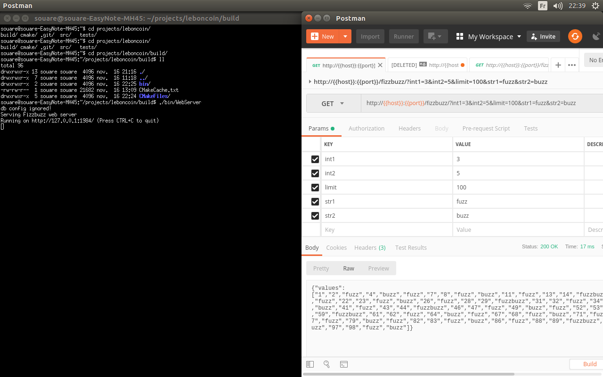

# C++ fizz-buzz REST server [](https://travis-ci.org/souaremsaidou/leboncoin) [](https://coveralls.io/github/souaremsaidou/leboncoin?branch=main) 

Motivation
----------

The original fizz-buzz consists in writing all numbers from 1 to 100, and just replacing all multiples of 3 by "fizz", all multiples of 5 by "buzz", and all multiples of 15 by "fizzbuzz". The output would look like this: "1,2,fizz,4,buzz,fizz,7,8,fizz,buzz,11,fizz,13,14,fizzbuzz,16,...".

Your goal is to implement a web server that will expose a REST API endpoint that: 
Accepts five parameters : three integers int1, int2 and limit, and two strings str1 and str2.
Returns a list of strings with numbers from 1 to limit, where: all multiples of int1 are replaced by str1, all multiples of int2 are replaced by str2, all multiples of int1 and int2 are replaced by str1str2.

Definition of Done
------------------

* Ready for production
* Easy to maintain by other developers
* Add a statistics endpoint allowing users to know what the most frequent request has been. This endpoint should:  
  * Accept no parameter
  * Return the parameters corresponding to the most used request, as well as the number of hits for this request

Api
---

https://documenter.getpostman.com/view/4259112/TVepA8k4

Build
-----

```bash
git clone https://github.com/souaremsaidou/leboncoin.git
mkdir leboncoin/build
cd leboncoin/build
sudo apt-get -y install libpqxx-dev libpq-dev postgresql-server-dev-all libboost-all-dev
cmake -DBUILD_COVERAGE=ON ..
make -j3 && make test -j3
```

Run
---


